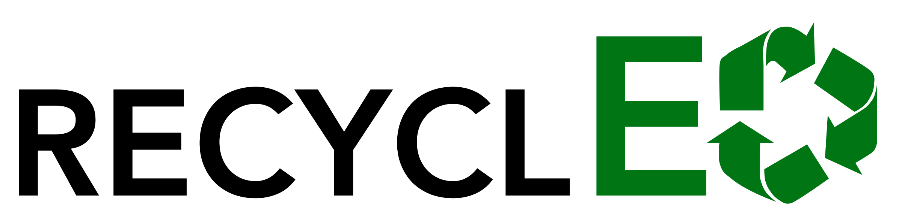

**RecyclED?**

RecyclED is an autonomous recycling bin that sorts rubbish into right correct category (General or Recyclable). There is a cart moving along the rail with trapdoor to drop the item. The cart machanism is operated with object recognition system and motion detection system.

The project has an AI model trained with 1000 specific images of the most common waste within an office setting. Starting from this, the business has a high potentials in its scalability to other environments.

The modular design of the hardware model contributed to the scalability of the product, which implies that the users can use their own bins. 

Product Model (3D modelled using Shapr3D)

* Overall look of the product


* Detail (modular) view of the product

    
    * Cart moving along the platform on top of bins placed.
    * Bins can be easily removed and put back in.


**Logo**
* White text version


* Black text verison



**Website**


https://github.com/HJulie11/Projects_Julie/assets/115992979/7294eaa0-025d-4d8c-a440-572f296df9b6


**How to run web dev**

1. Run frontend dev first

    Go to '/front-end' folder
    ```
    cd /path/to/front-end
    ```

    run npm commands
    ```
    npm install
    ```
    ```
    npm run dev
    ```

2. Run backend server

    Go to '/flask-backend' folder
    ```
    cd /path/to/flask-backend
    ```

    Follow the commands below in order:
    ```
    python3 -m venv env
    ```
    ```
    source env/bin/activate
    ```
    (env) from here
    ```
    pip3 install -r requirements.txt
    ```
    ```
    python3 main.py
    ```
**Demo Model**

https://github.com/HJulie11/Projects_Julie/assets/115992979/fbaecb81-1b78-442f-aa63-90376f3073fb


**Project details**
* Group of 8 people
* 4 in Software Team; other 4 in Hardware Team
* **My Main Contribution**: Project Manager, Web application Front-end Design and Development
* **Implementation**:
    * Web Application:
        * Next.js and TailwindCSS (Frontend)
        * Python Flask (Backend)
    * Hardware:
        * 3D Printed and Laser cut parts put together for cabinet (bin) and cart (moving inside the bin)
        * Cart Machanism:
            * A cart with camera mounted, detect motion (putting a trash into the bin) and move to the correct bin (recycling or general)
        * Raspberry Pi and Arduino for cart motor/movement scripting

* More details are written in Project report
