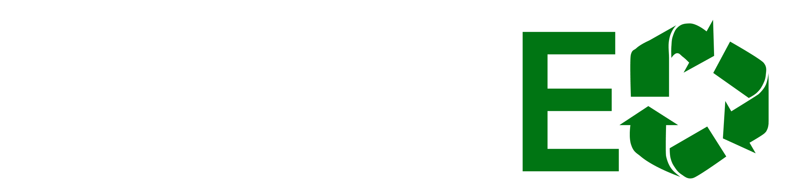

**RecyclED?**

RecyclED is an autonomous recycling bin that sorts rubbish into right correct category (General or Recyclable). There is a cart moving along the rail with trapdoor to drop the item. The cart machanism is operated with object recognition system and motion detection system.

The project has an AI model trained with 1000 specific images of the most common waste within an office setting. Starting from this, the business has a high potentials in its scalability to other environments.

The modular design of the hardware model contributed to the scalability of the product, which implies that the users can use their own bins. 

**Logo**

**Website**

<video src="../figs/website video.mov" controls="controls" width = "max"></video>